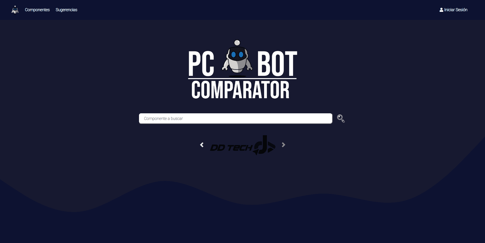
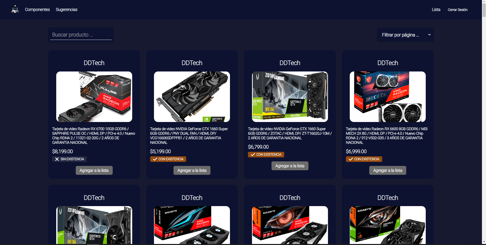
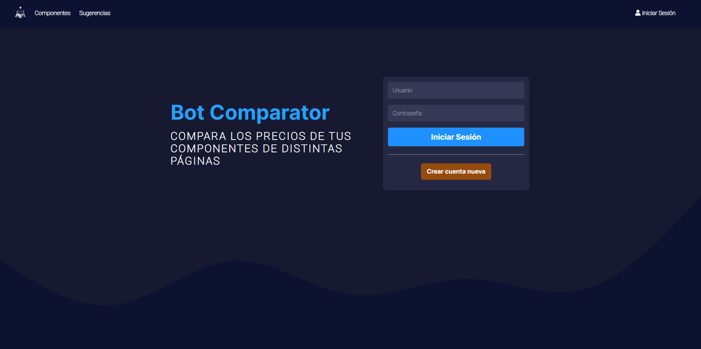
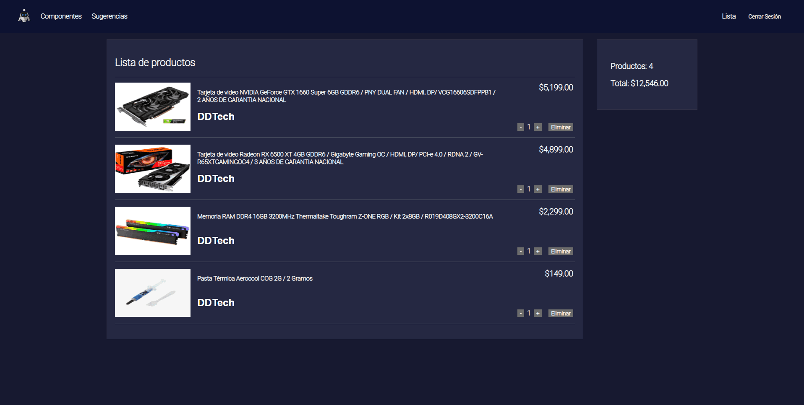

# Bot comparator

## Tabla de Contenidos

- [Bot comparator](#bot-comparator)
  - [Tabla de Contenidos](#tabla-de-contenidos)
  - [Preview](#preview)
    - [Screenshot](#screenshot)
  - [Proyecto](#proyecto)
    - [Links](#links)
  - [Proceso](#proceso)
    - [Construido con:](#construido-con)
  - [Autores](#autores)

## Preview

### Screenshot

## Proyecto

Este proyecto fue realizado como proyecto final de la materia Aplicaciones Web.

### Links

- Repositorio: [Solución](https://github.com/NogyOne/Apps-Web)

## Proceso

### Construido con:

- HTML
- CSS
- JavaScript
- Java JSP
- Java Servlets
- Bootstrap

## Autores

- GitHub - [@lMahesvara](https://github.com/lMahesvara)
- GitHub - [@Vastem](https://github.com/Vastem)
- GitHub - [@roberto-rw](https://www.github.com/oberto-rw)
- GitHub - [@NogyOne](https://github.com/NogyOne)
